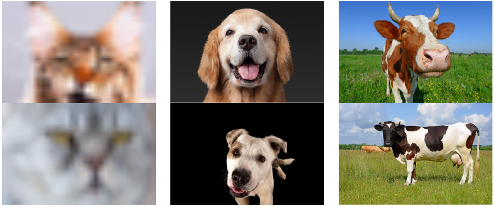
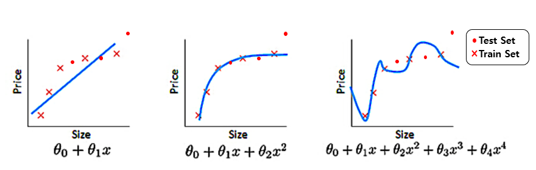

### Uncertainty의 유형
1. Out of Distribution Test Data 
   - 학습할 때 한번도 보지 못한 유형의 데이터가 Test에서 사용되는 경우. 예시로 개를 학습한 모델에 대해서 고양이 사진을 
주고 개의 종류를 판별하라고 하는 경우.

2. Aleatoric
    - 학습 데이터 자체에 노이즈가 많아서 데이터 자체에 문제가 있는 경우. 학습할 때 3가지 유형인 개,소,고양이에 대해 학습한다고 했을때
   고양이 이미지가 심하게 훼손된 데이터셋으로 학습하는 경우 이후 들어오는 고양이 이미지에 대해 제대로 분류하지 못하는 불확실성 발생.

3. Epistemic Uncertainty
    - 주어진 데이터셋을 가장 잘 설명할 수 있는 모델을 선택할 때 생기는 불확실성. 아래 그림 처럼 어떤 모델이 해당 데이터셋에 가장 적합한지
   알 수 없어서 생기는 불확실성이다. 3번째 그림이 가장 훈련 데이터에 대해 에러가 적지만 테스트 데이터에 대한 성능은 가장 낮다.

